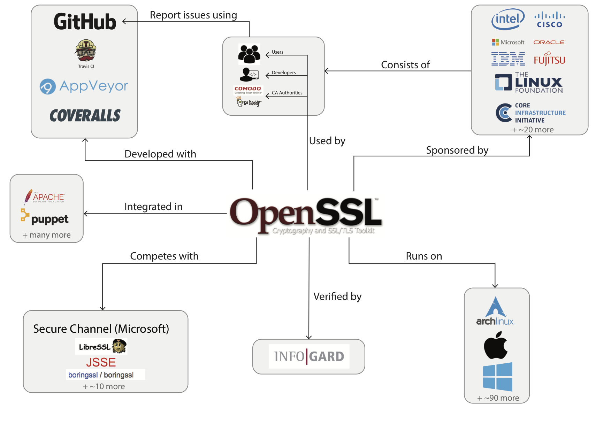

# OpenSSL

## Abstract

OpenSSL is a library and toolkit to provide secure communication by implementing the Transport Layer Security (TLS) and Secure Sockets Layer (SSL) protocols. OpenSSL is written in C. The goal of this chapter is to describe OpenSSL for possible contributors and other interested parties. 

We describe OpenSSL in the viewpoint of stakeholders, context and development and functional. We also touch on some of the challenges OpenSSL currently faces, this is described in the perspective of evolution. While OpenSSL is mature in terms of development hours, OpenSSL also has it shortcomings that needs to be addressed in the coming future.

## Table of contents

1. Introduction

2. Stakeholder Analysis

3. Context Viewpoint

4. Evolution Perspective

5. Functional viewpoint

6. Development Viewpoint

7. Conclusion

## 1. Introduction

OpenSSL is a SSL/TLS toolkit written in C, that besides providing functionality to create
a secure connection to another host, also allows encryption and decryption
of other data, key creation and certificate signing. According to datanyze.com, OpenSSL has the greatest market share in SSL technology, more than the proprietary implementation from Comodo [[1](#INTRO_DATANYZE)]. OpenSSL nowadays has an active community, and several developers working full time on the project. 

This chapter is an effort to analyze how OpenSSL is developed, who it is 
developed for, what its responsibilities are and how it fulfills these 
responsibilities. This analysis is started with a stakeholder analysis, after that, the context in which OpenSSL is developed is described. Next the evolution perspective is described. This evolution perspective is followed by
a functional view, which shows on a high level the workings of OpenSSL. Next, development view describes what is important for people wanting to contribute to OpenSSL. Finally, a conclusion is given on the OpenSSL project.

## 2. Stakeholders

This section first describes the different stakeholders and next projects them 
onto OpenSSL. 

| Type   |      Description      | 
|---|:---:|
| Acquirers | An acquirer is responsible for the financial survivability of the project, this includes sponsors. |
| Assessors |For widely used systems testing is important because bugs, not found by proper testing, can damage the system. Testers need te be independent to prevent any conflict of interest that may harm the systems security. Assessors also check for complience with legal regulations and defined standards. |
| Communicators | Communicators are the persons that do any communication to the outside world. This can be writing documentation, training people or marketing.|  
| Developers | A developer creates new features for the system examples are new encryption algorithms and updates to the API. |  
| Maintainers | The maintainers of a system are concerned with keeping it up and running. This involves fixing bugs, discussing its current architecture, planning future modification.|  
| Suppliers | A supplier makes the hardware, software or infrastructure on which a system will run. This stakeholder does usually not have an active role in the development of the system. It may be relevant when the supplier changes their platform drastically. |  
| Support Staff | Support staff provide the support to users using the product once it is running. They resolve issues but do not improve the product.|
| Users | Users will ultimately make use of the system. Their concerns are most of the time performance, security and functionality. While users are not closely involved with the development of the system, they still are important stakeholders. |

Steve Marquess is the business manager of the corporate entity of OpenSSL and is thereby an **acquirer**. Sponsors include large multinationals such as Cisco, Fujitsu, Hitachi, Huawai, IBM, Intel, Microsoft, NEC, Oracle, Qualcomm and Samsung.

OpenSSL is open-source, meaning that the software can be checked and improved by anyone (assuming that the pull request gets accepted). Matt Caswell, one of the three full time core developers, has github comments
regarding legal regulations[[2](#pull1956)]. A example of **assessors** quite specific for OpenSSL is a set of cryptographers. Creating a secure protocol is very hard because securtiy does not only depend on the strength of algorithm, but also on the entire chain of functions. Therefore, it is vital to have a set of cryptographers actively involved in the process. This is currently done by the validating company, InfoGard Laboratories[[7](#FIPS2)]. Another example are large organistations and governments. For example, Rohde & Schwarz Cybersecurity, a german based company ran an extensive test and extracted multiple problems from OpenSSL[[5](#RSC1)][[6](#RSC2)]. 

OpenSSL **maintainers** primarily focus on discussing issues and pull request. When looking at the recent history of the GitHub repository, Richard Levitte (@[levitte](https://github.com/levitte)), Rich Salz (@[richsalz](https://github.com/richsalz)) and Andy Polyakov (@[dot-asm](https://github.com/dot-asm)) are active in responding to issues and pull requests. 

Within OpenSSL the line between **maintainers** and **developers** is thin because a major feature update occurring is rare and many small new features can be considered bug fixes in some sense. An example of this is a recent pull request that changed return codes to clarify a process. This could be seen as a new feature because nothing was really broken. But at the same time a function should return clear results.

In an open-source environment such as OpenSSL **maintainers** also are **communicators** as they communicate with people outside of OpenSSL that want to contribute to the project, for example through GitHub. The documentation for OpenSSL is a community project. Each change in source code should be accompanied by an update to the respective documentation for a pull request to be accepted. By this reasoning, any contributor is also part **communicator**.

There are contracts to get direct support for OpenSSL where it is said that paid technical support is done by the team members or
close collaborators in the OpenSSL developer community [[9](#openssl_support)]. This means once again that both **developers** and **maintainers** have the extra role of being communicators. On GitHub, particularly Rich Salz, Matt Casswell and Richard Levitte are communicating actively. OpenSSL does not do significant marketing although Steve Marquess does the business related communications.

The companies Coveralls[[3](#coveralls)] and Travic-CI[[4](#travis_ci)] are **suppliers**, they provide OpenSSL with the tools to do automatic testing and measuring code coverage. Intel is also an **supplier**, they provide chips with AES implementations.

OpenSSL **users** vary from Internet users to software engineers encrypting their system using OpenSSL. Some **users** do not even know they are using it while others need to know OpenSSL in detail to guarantee system security. 

As can be seen identifying which class of stakeholder someone is in, is not a straight forward process. As an architect chooses have to made. The larger the group of stakeholders, the more difficult it is to reach a consensus. But ignoring some classes can lead to problem in the future. For OpenSSL **maintainers**, **communicators**, **assessors** and **acquirers** are the most important. OpenSSL has to be maintained to prevent heartbleed-like issues. users must know how to use OpenSSL. OpenSSL must comply with industry standards and enough funding is required to allow further development.

## 3. Context view

A method to investigate how a system interacts with its environment is by
creating a context view. A context view shows the relation between a system and 
the different types of stakeholders, systems or organisations it depends on and 
interacts with. Ultimately, it helps to get an overview of what a system does 
(should) or does not (should not) do. 

Figure 1. Context view 

In the diagram in Figure 1, three kinds of users are indicated. First there are 
the users that use a browser to get a safe connection to a website with an 
OpenSSL server. These people generally have no idea about the underlying system, but heavily rely on it to work. Secondly, there are developers of websites that want to allow their customers to connect securely to their servers. Usually they do not develop for OpenSSL and also may not exactly know how it works.
Thirdly there are the certificate authorities, that should not distribute 
certificates that are not accepted by OpenSSL. Even though there is an SSL 
standard that both OpenSSL and the certificate authorities should adhere to, 
OpenSSL can for example make choices that affect the validity of certain 
certificates [[9](#CV_ISSUE)].

As an open source project, OpenSSL is mainly sponsored by companies that use
OpenSSL for their secure connections. Sponsoring can be monetary, or companies 
can have people on their payroll work on OpenSSL. The money can be used for 
paying people (OpenSSL has three full time employees [[10](#CV_EMPLOYEES)]) or 
paying for testing and verification services.

Automated testing is done by AppVeyor and Travis-CI, that both offer free 
service to open source projects. When source code also adjusts tests, Coveralls
provides an overview of the coverage of the test cases. Coveralls, too, provides
free services to open source projects.

The main competing SSL implementations are *Secure Channel* from Microsoft,
and *JSSE*, which is developed by Oracle for Java.
Secure Channel is used for Windows platforms, and JSSE enables secure 
connections in Java programs. The other two SSL implementations, boringssl [[11](#CV_BORINGSSL)] and LibreSSL[[12](#CV_LIBRESSL)], are forks from OpenSSL in response to the Heartbleed bug[[13](#CV_HEARBLEED)]. BoringSSL is developed by google, and LibreSSL is trying to modernize and refactor the existing OpenSSL code.

## 4. Evolution
### The start
OpenSSL was created as a successor of the SSLeay. SSLeay was a project which started in 1994, in a time when SSL implementations had to be bought instead of being freely available [[14](#EV-EAY-BOOK)]. Eric Andrew Young and Tim J. Hudson began working on SSLeay as a hobby project, before a lack of time forced them to abandon it in 1999. SSLeay was not designed in advance, but grew organically [[15](#EV-EAY-DOCS)].

In 1999 a team of software engineers started a new project, OpenSSL, with SSLeay at its core. Communications were done via mailing lists and changes were done via patches. However, the policies were not documented and the code was released sporadically. By 1999 there was already a considerable technical debt, because software engineering in open source projects was still in its early ages when SSLeay was created. This can be seen in the achitecture which in some aspects can be described by the anti pattern "Big ball of mud".
 
### The stagnation
From 1999 onwards the technical debt only started increasing and soon OpenSSL was crushing itself under heaps of technical debt. In 2002 an issue tracker was introduced. Every year 125 open tickets were accumulated, resulting in approximately 1500 open tickets by 2014, as can be seen in Figure 2. By 2009 only a small team of two authors was left. By 2014 only 55% of the SSLeay was still alive in the code. Salz describes the codebase as complex, arcane, hard to maintain and even harder to develop new features for. One of the reasons which might explain these dreary circumstances is that OpenSSL only received about $2.000 per year in donations, leaving not much room for dedicated support from maintainers [[16](#EV-RICH)]. In other words, these 12 years were a breeding ground for technical debt. When taking all this misery into account, the following crisis is no surprise.

Figure 2. Evolution of tickets in rt.openssl.com
 
### The crash
In 2014 Heartbleed was discovered; the ever-famous bug which shook the digital world. It took about two years from the error until the discovery of this bug, which made all servers that used OpenSSL potentially insecure. This crisis inspired a group of OpenBSD developers to modernize the codebase of OpenSSL and to remove a lot of insecure and deprecated functions. This new project is called LibreSSL. In the first week of development, about 90.000 lines of OpenSSL code was removed.
Another effect of the Heartbleed bug was the sudden realization of the criticality and the dependence on OpenSSL by both developers and companies like Google, Facebook, IBM, Intel and Microsoft. Therefore, these users began to contribute and donate to the further development and improvement of OpenSSL. The current donation is estimated to be more than $300.000 per year, which is incomparable with the donations previous to 2014. Because of this major turnaround and the significant raise in contributions, the amount of tickets open was halved in just two months. Currently, there are about 300 tickets open and the amount of original code is reduced to 16%. Furthermore, the number of active maintainers grew to about 12.

## 5. Functional View
The runtime functional elements and responsibilities of OpenSSL are represented 
in the functional view that is introduced in this chapter. An idealized impression of the current state of the architecture is shown in 
Figure 3. This idealized impression was constructed by reading the documentation 
and the module descriptions.

  
Figure 3. Idealized impression of the OpenSSL architecture

It can be seen that on a high level, the architecture can be described as layered.

### Userspace Layer
The first layer, the **userspace layer**, consists of the programs OpenSSL provides its users with, or
any program that uses the OpenSSL library. All programs here are 
completely separate entities, and have little to no dependencies between them.

### Abstraction Layer
The second layer is the API and **abstraction layer**, with separate abstractions 
for SSL/TLS functionality (SSL), crypto functionality (EVP), and BIO which 
provides a Basic Input/Output abstraction that tries to hide I/O details from an 
application.

**EVP**: 
The EVP ("Envelope") module is a high-level interface to the cryptographic
functions that OpenSSL provides [[17](#FV_EVP)]. It allows encryption, decryption,
signing and verification of data, independent of the algorithm someone would
want to use.

**BIO**: 
The BIO (Basic Input Output) module provides BIOs, which  are stream 
abstractions that can act as sources, sinks or filters. It is very similar to 
C's `FILE *`.

**SSL/TLS**: 
The SSL/TLS module provides the functions to set up a secure connection. The
module does not consist of just API functions but also implements the 
functionality to open connections and do the handshakes.

### Implementation Layer
Finally, the third layer is the implementation layer, where an Engine module provides 
access to both software and hardware implementations of crypto algorithms. 

**Software Crypto**: 
The Software Crypto module is by far the largest module and the core of OpenSSL.
It contains multiple interconnected submodules that implement different 
cryptography algorithms, for example for encrypting and decrypting data,
but also for creating and handling keys. All these modules are shown as one 
block to keep the figure readable.

**Engine**: 
The Engine module provides ENGINE objects to create and manipulate cryptographic
modules. It also contains abstraction, and allows the use of hardware
crypto implementations when they are available. Like SSL/TLS, it is a bit of 
a hybrid between API and implementation.

**Hardware Crypto**: 
The Hardware Crypto module consists of hardware implementations of cryptographic
algorithms. This hardware is not provided by OpenSSL, but it does OpenSSL does
allow its functionality to be used. 

### Actual architecture
As could be expected from a 20 year old project that has grown piece by piece
without the existence of any diagrams that describe the project[[19](#FV_MAIL)], 
the architecture is not as nice as the one described in Figure 3.
Indeed, the lack of overview over the project and the resulting entanglement
of modules is what makes OpenSSL extremely complex and hard to maintain.
After Heartbleed, things have become better, but the extremely high amount of
dependencies in the project definitely holds it back. 

Figure 4 shows the current state of the project. 

  
Figure 4. More realistic representation of the OpenSSL architecture

## 6. Development view
Certain principles and guidelines have been defined by the OpenSSL maintainers,
bv which both they themselves, and other contributors, have to abide. These
principles and guidelines define how the code and the project as a whole 
are managed. 

### Principles
The core principle that governs the development of the system that is most 
clearly apparent is the principle that everything that is added, must be tested.
OpenSSL runs tests using Coveralls, and aims to have at least a coverage of
67% before October 2017[[20](#ROADMAP)]. Currently, the test coverage is at 58% [[21](#COVERALL-main)], coming from 54% in August 2016 [[22](#COVERALL-start)].
Considering the enormous codebase OpenSSL consists of, this is a significant 
increase in test coverage, though the road to 67% will be long. It should also 
be mentioned that according to a paper from Bullseye, 70%-80% is reasonable[[23](#BULLSEYE)], and that it should be higher for safety-critical systems. If anything, OpenSSL can be considered safety-critical for a lot of systems. 
    
OpenSSL principles dictate now that any code that is added, should be 
accompanied by a test case. For a commit to be accepted, it should not give 
compiler warnings, and a Contributor License Agreement (CLA) has to be signed.

OpenSSL keeps reported security leaks private, between the maintainers, until
they are solved. The OpenSSL website states about this principle: "The more people you tell in advance the higher the likelihood that a leak will occur. This has happened before, both with OpenSSL and other projects.". Because OpenSSL is used a lot it is in the interest of all stakeholders that leaks with a high priority are solved quickly [[24](#SECURITY)].

Another principle is about memory usage: always minimize the footprint.
This can be seen, for example, when investigating the engine.
An cryptographic implementation is only loaded for as long as it is needed.

### Guidelines
Guidelines and principles of a project are often tightly connected. The 
principle that all new code must be tested is accompanied with the guideline
that all contributions that add code have to add appropriate test cases. 
Similarly, new features or a change in functionality must be documented 
accordingly. 

After March 29, 2010 the release guideline was modified to meet the users and
maintainers expectations. When the release only changes the last digit of the 
version number, it will contain new features but it does not change the API and
CLI of OpenSSL. When there is a letter appended or the is letter changed to the
version number it will only contain bug and security fixes[[25](#RELEASE-STRAT)]
. 

Linux is the primary development platform of all maintainers. Secondary platforms that at least one maintainer supports are FreeBSD, Windows, MacOS X and VMS. All other platforms are either supported by the community or not at all [[26](#PLATFORM)]. 

All OpenSSL source-code must be conform with the coding style and is
derived from the Linux kernel coding style.
This is a very common coding style, demanding, amongst other things,
underscores_in_names, ALLCAPS for consts and defines and descriptive variable names for non iterator variables.

>Coding style is all about readability and maintainability using commonly
available tools. OpenSSL coding style is simple. Avoid tricky expressions[[27](#CODING-STYLE)].

## 7. Conclusion

A conclusion will be added here in the future!

## References
1. 
 Unknown author. OpenSSL marketshare, https://www.datanyze.com/market-share/ssl/openssl-market-share. March, 2017
2. 
 Pull request regarding legal regulations. https://github.com/openssl/openssl/pull/1956. March, 2017.
3. 
 Unknown author. Coveralls website. https://coveralls.io/. May, 2017.
4. 
 Unknown author. Travic-CI website. https://travis-ci.org. May, 2017.
5. 
 John Leyden. German government get involved in OpenSSL. https://www.theregister.co.uk/2016/02/04/openssl\_mediocre\_german\_gov_audit/. February 2016.
6. 
 Rohde & Schwarz acquires enterprise security specialist Sirrix AG. https://www.rohde-schwarz.com/us/news-press/press-room/press-releases-detailpages/rohde-schwarz-acquires-enterprise-security-specialist-sirrix-ag-press_releases_detailpage_229356-119553.html. May, 2015.
7. 
 Unknown author. Security Policy OpenSSL https://www.openssl.org/docs/fips/SecurityPolicy-2.0.pdf. March, 2017.
8. 
 Unknown author. OpenSSL Support https://www.openssl.org/support/contracts.html. March, 2017.
9. 
 @chenchuAtXidian "https://github.com/openssl/openssl/issues/2620". March, 2017.
10. 
 C. Stokel-Walker "https://qz.com/286210/how-an-unprecedented-face-to-face-meeting-of-11-geeks-will-make-the-internet-more-secure/". March, 2017.
11. 
 Unknown author. https://boringssl.googlesource.com/boringssl/. March, 2017.
12. 
 Unknown author. https://www.libressl.org/. March, 2017.
13. 
 Unknown author. http://heartbleed.com/ Retrieved on 2017-03-20.
14. 
 Simson Garfinkel, Gene Spafford (2002). Web Security, Privacy & Commerce. O'Reilly
15. 
 Unknown author. "Bundle of old SSLeay documentation files". https://raw.githubusercontent.com/openssl/openssl/91bad2b09eb2ad77da8aca29f80f2d0677e75423/doc/ssleay.txt. March, 2017.
16. 
 Rich Salz. "Software Engineering and OpenSSL is not an oxymoron". https://threatpost.com/openssl-past-present-and-future/112485/. March, 2017.
17. 
 Unknown author. "OpenSSL wiki EVP", https://wiki.openssl.org/index.php/EVP. March, 2017.
18. 
 Unknown author. "OpenSSL wiki BIO", https://wiki.openssl.org/index.php/BIO. March, 2017.
19. 
 Rich Salz, "Personal communication (email)"
20. 
 Unknown author. "Roadmap", official OpenSSL documentation, https://www.openssl.org/policies/roadmap.html. March, 2017.
21. 
 Unknown author. "Coverall OpenSSL", https://coveralls.io/github/openssl/openssl. March, 2017.
22. 
 Unknown author. "Coverall OpenSSL - August 2016", https://coveralls.io/repos/65739/builds?page=166. March, 2017.
23. 
 Steve Cornett, "Bullseye - Minimum Acceptable Code Coverage", http://www.bullseye.com/minimum.html. March, 2017.
24. 
 Unknown author. "Security Policy", official OpenSSL documentation https://www.openssl.org/policies/secpolicy.html. March, 2017.
25. 
 Unknown author. "Release Strategy", official OpenSSL documentation https://www.openssl.org/policies/releasestrat.html. March, 2017.
26. 
 Unknown author. "Platform Policy", official OpenSSL documentation https://www.openssl.org/policies/platformpolicy.html. March, 2017.
27. 
 Unknown author. "Coding Style", official OpenSSL documentation https://www.openssl.org/policies/codingstyle.html. March, 2017.

## Plan Of Attack:

This plan closely follows the proposed table of contents, so this one can
only be accepted after accepting the TOC.

#### Abstract
The first version of the abstract is written. However, this abstract does not
include the new viewpoint and the new perspective, yet. The current version 
might be sufficient.

#### Table of Contents
Still needs clickable links

#### 1. Introduction
The introduction is mainly done, but a bit short.

#### 2. Stakeholder Analysis
The stakeholder analysis has been performed for the first deadline. The feedback
on that text was that it needed some more depth. We're not sure if we can go
more in depth in the final chapter, due to constraints to the wall of text we
are allowed to create. The current version might be sufficient.

#### 3. Context Viewpoint
Also the context viewpoint has been copied from the second deadline. Also this
viewpoint needs more depth if we have enough space though the current version
might be sufficient.

#### 4. Evolution Perspective
The current part about evolution may not count as evolution perspective, so
we will wait for the feedback to see what we should do with it.

#### 5. Functional Viewpoint
Most text we had from the architecture has be moved here, plus some extra 
information. Also it interferes with the development viewpoint, and some
balance here needs to be found. Current version might be sufficient.

#### 6. Development Viewpoint
The development viewpoint has been created already, but interferes with the
functional viewpoint. Probably needs some development-focused text about the
software architecture and some text about git.

#### 7. Conclusion
In the end we will write a conclusion, which will very shortly summarize the 
results of what we found by analyzing OpenSSL, and we will look at the future
of OpenSSL. This has not been done yet.
